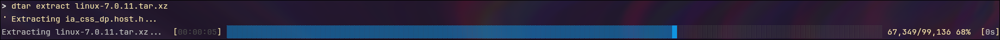

# dtar



## Syntax

```bash
dtar [-h] <SUBCOMMAND>...
```

## Installation

Provided you have cargo and have .cargo/bin in $PATH:

```bash
cargo install --git https://github.com/Commensalism1997/dtar.git
```
